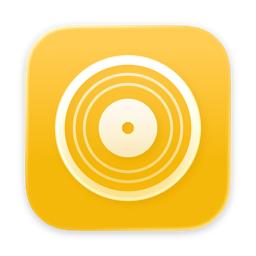
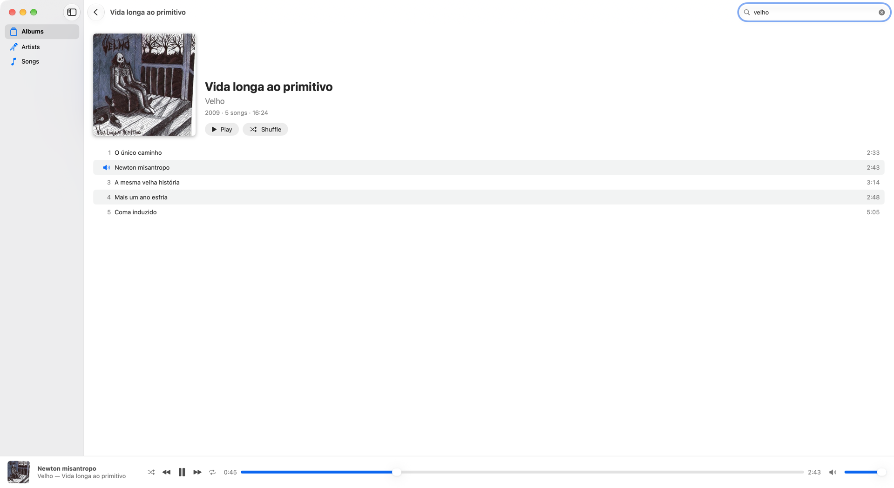

<p align="center"></p>

# Overdrive

[](https://github.com/skhaz/overdrive/actions/workflows/release.yml)
[](https://github.com/skhaz/overdrive/releases/latest)

Music player for macOS 26 or later.



- No database. It scans the music folders at launch and when they change. It writes to them only when you save lyrics.
- Plays all formats that AVFoundation supports: AAC, HE-AAC, ALAC, MP3, FLAC, Opus, Vorbis, WAV, AIFF, and CAF.
- Shows album covers from the embedded artwork or from an image in the album folder.
- Shows and edits lyrics in a sidebar.
- Sends scrobbles to Last.fm.
- Opens tracks and albums in Mp3tag from the context menu.
- Press Control-P to clear the search field and type a new search.
- Click the cover or the title in the player bar to open the album that plays.

## Lyrics

Click the lyrics button in the toolbar to show the lyrics of the song that plays, or choose Lyrics from the context menu of a song.

- The app reads the lyrics from the `.lrc` file next to the song, for example `Song.lrc` for `Song.mp3`.
- When the song changes, the sidebar shows the lyrics of the new song.
- When you leave the album, the sidebar closes.
- If there is no `.lrc` file, the app gets the lyrics from [LRCLIB](https://lrclib.net). It writes nothing until you click Save.
- Click Save (Command-S) to write the `.lrc` file. Save with an empty text to delete the file.
- If you close the sidebar or open other lyrics with unsaved changes, the app asks you to discard them.

## Install

```sh
brew install --cask skhaz/tap/overdrive
```

## Uninstall

```sh
brew uninstall --zap --cask overdrive
```

## Build

```sh
./build.sh
```

Use a local build only to debug or to profile.

## Release

Do these steps for each change:

1. Commit the change and push it to `main`.
2. Push a new tag, for example `v0.1.12`. The GitHub Action builds the app, creates the GitHub release, and updates the cask in `skhaz/homebrew-tap`.
3. When the action completes, install the release:

```sh
brew update
brew upgrade --cask overdrive
```

Do not run a local build as the installed app.

## Last.fm

1. Get an API key at https://www.last.fm/api/account/create.
2. Build with the key: `LASTFM_KEY=... LASTFM_SECRET=... ./build.sh`.
3. Open Settings, enter the Last.fm username (not the email) and password, and click Connect. The app keeps only the session key, in `~/Library/Application Support/Overdrive/lastfm.plist`.
